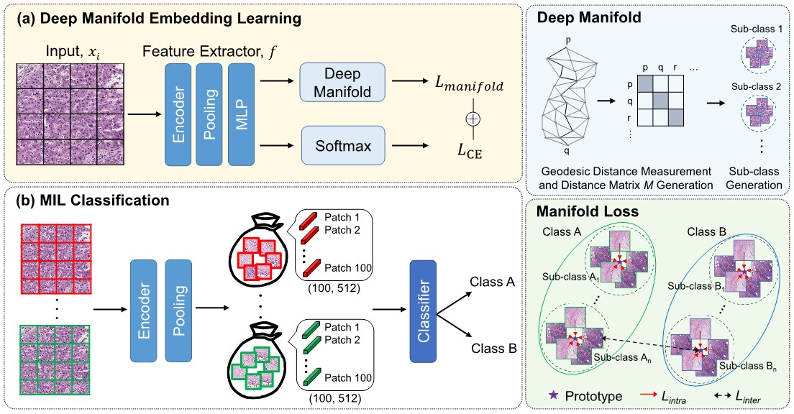

# Histopathology Image Classification using Deep Manifold Contrastive Learning (MICCAI 2023)

[[Paper](https://arxiv.org/abs/2306.14459)]

  

# Framework 
Tensorflow 2

# Dataset 
The hepatocellular carcinomas (HCCs) dataset can be downloaded from [Pathology AI Platform](http://www.wisepaip.org/paip).
